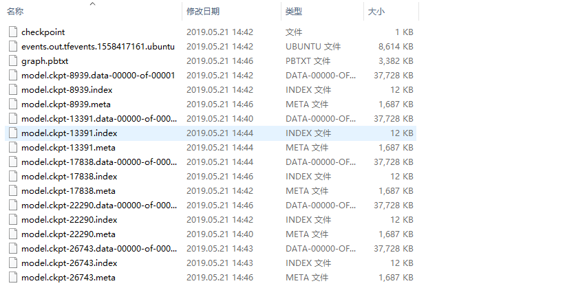
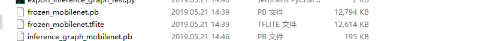
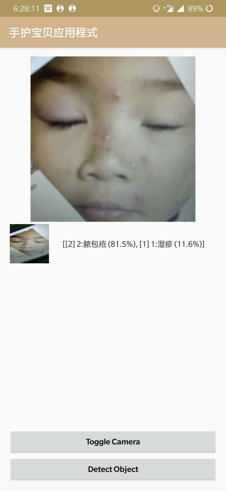
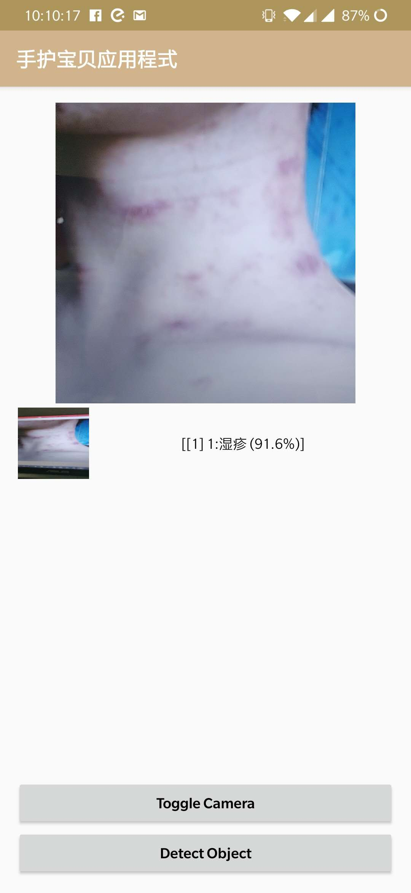

# Child_skin_disease_detect
# 儿童皮肤病检测

- <B>数据获取
  ####使用spider.py文件[爬取网站](https://medicine.uiowa.edu/dermatology/education/clinical-skin-disease-images)上的常见疾病图片,我们爬取了大概165种疾病.
- <B>数据增强
 #### 使用dataAugmentation.py文件进行数据增强，增强因素包括以下方式
 ```
    # 指定参数
    rotation_range=40,     #rotation_range 旋转
    shear_range=0.2,       #剪切强度(逆时针方向的剪切变换角度)。是用来进行剪切变换的程度。
    zoom_range=0.2,        #zoom_range 随机放大或缩小
    width_shift_range=0.2, #width_shift_range 左右平移
    height_shift_range=0.2,#height_shift_range 上下平移
    channel_shift_range=0, #随机通道偏移的幅度。
    horizontal_flip=True,  #随机水平翻转
    vertical_flip=True,    #随机垂直翻转
    fill_mode='nearest'    #当进行变换时超出边界的点将根据本参数给定的方法进行处理
 ```
 - <B>生成tfrecode文件
##### ①首先进入.src/src/datasets/slim/文件夹中,新建对应的数据集名称的文件夹,这里我新建的是
 illness_new.py文件
```
# Copyright 2016 The TensorFlow Authors. All Rights Reserved.
#
# Licensed under the Apache License, Version 2.0 (the "License");
# you may not use this file except in compliance with the License.
# You may obtain a copy of the License at
#
# http://www.apache.org/licenses/LICENSE-2.0
#
# Unless required by applicable law or agreed to in writing, software
# distributed under the License is distributed on an "AS IS" BASIS,
# WITHOUT WARRANTIES OR CONDITIONS OF ANY KIND, either express or implied.
# See the License for the specific language governing permissions and
# limitations under the License.
# ==============================================================================

Provides data for the flowers dataset.

The dataset scripts used to create the dataset can be found at:
tensorflow/models/research/slim/datasets/download_and_convert_flowers.py
"""

from __future__ import absolute_import
from __future__ import division
from __future__ import print_function

import os
import tensorflow as tf

from datasets import dataset_utils

slim = tf.contrib.slim

_FILE_PATTERN = 'illness_new_%s_*.tfrecord'

SPLITS_TO_SIZES = {'train': 4000, 'validation': 1000}#填写的是验证和训练的数据比例

_NUM_CLASSES = 5  ##网络类别

_ITEMS_TO_DESCRIPTIONS = {
    'image': 'A color image of varying size.',
    'label': 'A single integer between 0 and 4',
}


def get_split(split_name, dataset_dir, file_pattern=None, reader=None):
  """Gets a dataset tuple with instructions for reading flowers.

  Args:
    split_name: A train/validation split name.
    dataset_dir: The base directory of the dataset sources.
    file_pattern: The file pattern to use when matching the dataset sources.
      It is assumed that the pattern contains a '%s' string so that the split
      name can be inserted.
    reader: The TensorFlow reader type.

  Returns:
    A `Dataset` namedtuple.

  Raises:
    ValueError: if `split_name` is not a valid train/validation split.
  """
  if split_name not in SPLITS_TO_SIZES:
    raise ValueError('split name %s was not recognized.' % split_name)

  if not file_pattern:
    file_pattern = _FILE_PATTERN
  file_pattern = os.path.join(dataset_dir, file_pattern % split_name)

  # Allowing None in the signature so that dataset_factory can use the default.
  if reader is None:
    reader = tf.TFRecordReader

  keys_to_features = {
      'image/encoded': tf.FixedLenFeature((), tf.string, default_value=''),
      'image/format': tf.FixedLenFeature((), tf.string, default_value='png'),
      'image/class/label': tf.FixedLenFeature(
          [], tf.int64, default_value=tf.zeros([], dtype=tf.int64)),
  }

  items_to_handlers = {
      'image': slim.tfexample_decoder.Image(),
      'label': slim.tfexample_decoder.Tensor('image/class/label'),
  }

  decoder = slim.tfexample_decoder.TFExampleDecoder(
      keys_to_features, items_to_handlers)

  labels_to_names = None
  if dataset_utils.has_labels(dataset_dir):
    labels_to_names = dataset_utils.read_label_file(dataset_dir)

  return slim.dataset.Dataset(
      data_sources=file_pattern,
      reader=reader,
      decoder=decoder,
      num_samples=SPLITS_TO_SIZES[split_name],
      items_to_descriptions=_ITEMS_TO_DESCRIPTIONS,
      num_classes=_NUM_CLASSES,
      labels_to_names=labels_to_names)

 ```
 #### ②
 在./src/src/slim/datasets/datafactory.py中添加
 ```python
    datasets_map = {
    'cifar10': cifar10,
    'flowers': flowers,
    'imagenet': imagenet,
    'mnist': mnist,
    'illness':illness,
    'illness_new':illness_new
}
对应的数据集的字典
```
#### ③
在./src/src/slim/文件夹中,运行
```python
python create_tfrecord.py \ 
    --dataset_dir=../../../dataset_dir \  #数据集的位置
    --tfrecord_filename=illness_new\   ##生成的tfrecord的文件名
    --validation_size=0.2
```
生成的文件如图所示<br>
#### ④训练
我基于mobilenet_v2进行了迁移,同时模型是基于预训练模型的基础上进行的
预训练模型是官方给的训练模型，在./src/src/slim/mobinet_v1_1.0.224/上
cd进入src/src/slim/，运行
```python
python train_image_classifier.py \
    --train_dir=./train_dir \
    --dataset_dir=../../../dataset_dir\ ##tfrecord文件所在位置
    --dataset_name=illness_new \        ##数据集的名字
    --dataset_split_name=train \
    --model_name=mobilenet_v1 \
    --train_image_size=224 \
    --checkpoint_path=./mobilenet_v1_1.0_224/mobilenet_v1_1.0_224.ckpt \
    --max_number_of_steps=30000 \    
    --checkpoint_exclude_scopes=MobilenetV1/Logits
```

在train_dir中可以看到生成的<br>

测试模型
```python
python eval_image_classifier.py \
    --alsologtostderr \
    --checkpoint_path=./train_dir/model.ckpt-30000 \  ##从checkpoint最后一个开始作为基准点
    --dataset_dir=../../../dataset_dir \
    --dataset_name=hp_plants \
    --dataset_split_name=validation \
    --model_name=mobilenet_v1 \
    --eval_image_size=224
```
整体的模型还可以，准确率大概有90%+

生成pb文件
```python
python export_inference_graph.py \
  --alsologtostderr \
  --model_name=mobilenet_v1 \
  --output_file=./inference_graph_mobilenet.pb \
  --dataset_name=illness_new
```
固定pb文件
```python
python freeze_graph.py \
    --input_graph=./inference_graph_mobilenet.pb \
    --input_binary=true \
    --input_checkpoint=./train_dir/model.ckpt-3000 \
    --output_graph=./frozen_mobilenet.pb \
    --output_node_names=MobilenetV1/Predictions/Reshape_1
```
这里有两个地方容易搞错。第一个地方，input_checkpoint参数实际上用到的文件应该是model.ckpt.data-00000-of-00001，但是在指定文件名的时候只需要指定model.ckpt即可。
第二个地方，是output_node_names参数，此处指定的是神经网络图中的输出节点的名字，是在训练阶段的Python脚本中定义的。


#### 转化为tflite格式(有点麻烦)
- 安装bazel，可以参考[官方教程](https://docs.bazel.build/versions/master/install-ubuntu.html?userToken=6d6Cr4SpciN2DfyzLno3Uw%3D%3D&userName=4HtSQQrLr9f%2BvtIn5bm%2B6g%3D%3D&time=1552793164685)
- git clone [tensorflow/tensorflow](https://github.com/tensorflow/tensorflow)到本地文件夹中
- 我的服务器支持GPU,所以运行
```shell
$ bazel build --config=opt --config=cuda //tensorflow/tools/pip_package:build_pip_package 
```
- 然后
```python
~/tensorflow-master/bazel-bin/tensorflow/lite/toco/toco --input_file=mobilenet_v1_1.0_224_frozen.pb --input_format=TENSORFLOW_GRAPHDEF --output_format=TFLITE --output_file=model.lite --inference_type=FLOAT --input_type=FLOAT --input_arrays=input --output_arrays=MobilenetV1/Predictions/Reshape_1 --input_shapes=1,224,224,3
```
- 最后得到如图所示的<br>


#### Demo(胆小勿看)
样例1
<br>
<br>
样例2



